<h1 style="font-size: 4.1rem;">Lifespan Normative Modeling</h1>

<h2 style="font-size: 2rem; font-style: italic;">Charting Healthy Norms & Detecting Pathological Deviations</h2>

 Presentation slides for the 
 [CSC Retreat 2025](https://sina-mansour.github.io/csc_retreat_2025_presentation/)

  <a href="https://sina-mansour.github.io/" target="_blank" class="slidev-icon-btn">
    <carbon:user-avatar-filled />
  </a>
  <a href="https://github.com/sina-mansour" target="_blank" class="slidev-icon-btn">
    <carbon:logo-github />
  </a>

  
  

    
Sina Mansour L.

    
National University of Singapore & The University of Melbourne

    
<carbon:email /> sina.mansour.lakouraj@gmail.com

  

  <carbon:calendar /> Nov. 19. 2025

---
layout: default
transition: slow-fade
---

# Normative Modeling

ℹ️ Background

  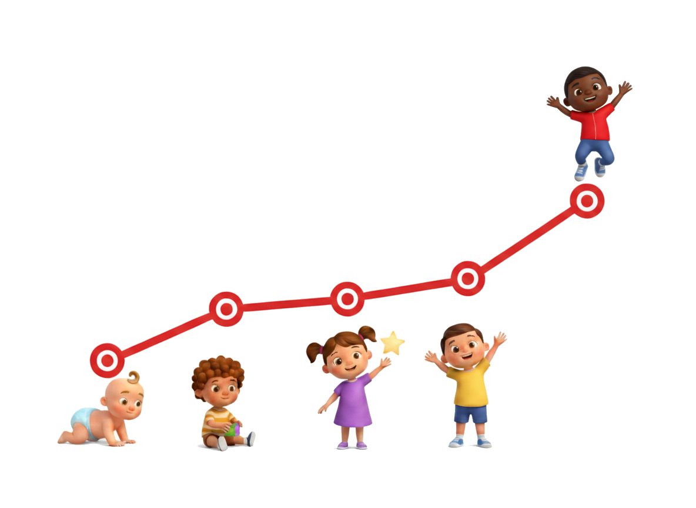

  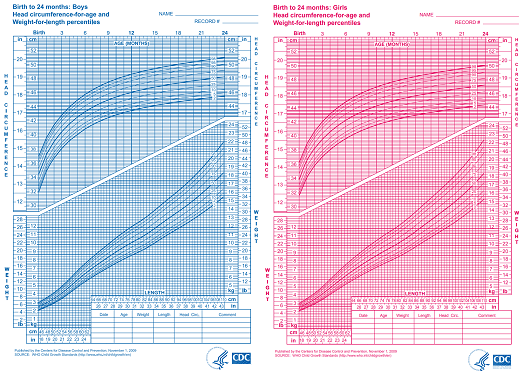
  
<a href="https://doi.org/10.1038/s41380-019-0441-1">WHO (2006)</a>

<myFooter />

---
layout: default
transition: slow-fade
---

# Normative Modeling

ℹ️ Background

<ul class="text-5" v-motion:initial="{ x: -20 }":enter="{ x: -20 }">
  <li class="flex gap-2 pb-2">
    
<carbon:send />

    
Characterize population-level phenotype distribution to detect individual deviations.

  </li>
</ul>

  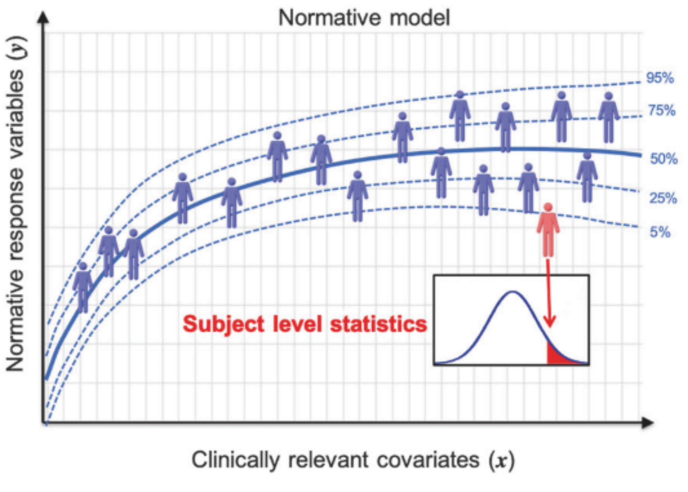
  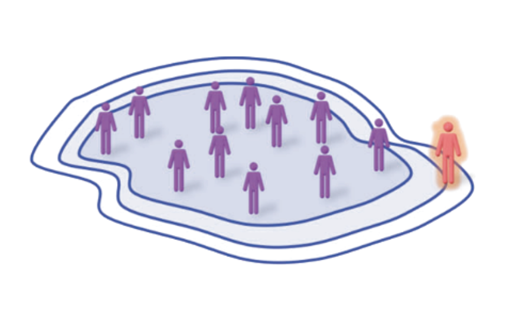
  
<a href="https://doi.org/10.1038/s41380-019-0441-1">Marquand et al. (2019)</a>

<myFooter />

---
layout: default
transition: slow-fade
---

# Normative Modeling

ℹ️ Background

<ul class="text-5" v-motion:initial="{ x: -20 }":enter="{ x: -20 }">
  <li class="flex gap-2 pb-2">
    
<carbon:send />

    
Map lifespan brain charts using large-scale imaging data.

  </li>
</ul>

  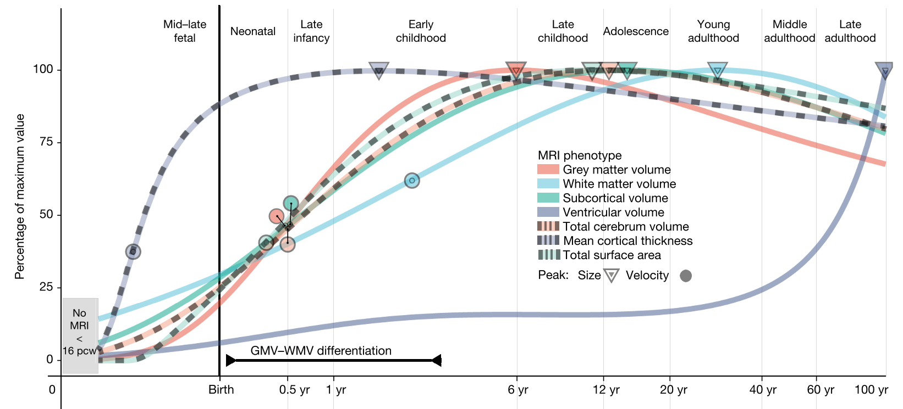
  
<a href="https://doi.org/10.1038/s41380-019-0441-1">Bethlehem et al. (2022)</a>

<myFooter />

---
layout: default
transition: slow-fade
---

# Normative Modeling

ℹ️ Background

<ul class="text-5" v-motion:initial="{ x: -20 }":enter="{ x: -20 }">
  <li class="flex gap-2 pb-2">
    
<carbon:send />

    
Enables exploration of individual-level differences and heterogeneity of deviations.

  </li>
</ul>

  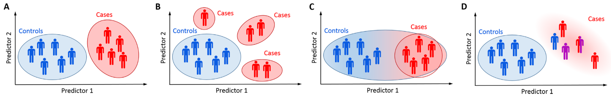
  
<a href="https://doi.org/10.1016/j.biopsych.2015.12.023">Marquand et al. (2016)</a>

<myFooter />

---
layout: default
transition: slow-fade
---

# Conventional Normative Modeling

🎯 Direct Model

<ul class="text-5" v-motion:initial="{ x: -20 }":enter="{ x: -20 }">
  <li class="flex gap-2 pb-2">
    
<carbon:send />

    
Trained to infer normative ranges of a predefined fixed phenotype (y) from a set of covariates (X).

  </li>
</ul>

  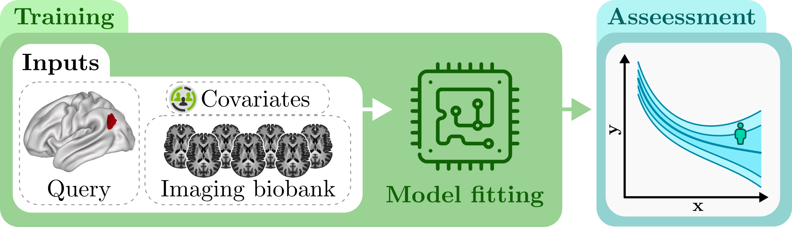
  
<a href="https://doi.org/10.1101/2025.01.16.25320639">Mansour L. et al. (2025)</a>

<myFooter />

---
layout: default
transition: slow-fade
---

# Spectral Normative Modeling (SNM)

💡 The idea?

<ul class="text-5" v-motion:initial="{ x: -20 }":enter="{ x: -20 }">
  <li class="flex gap-2 pb-2">
    
<carbon:send />

    
Idea: Use graph spectral decomposition to compress and reconstruct normative ranges.

  </li>
</ul>

  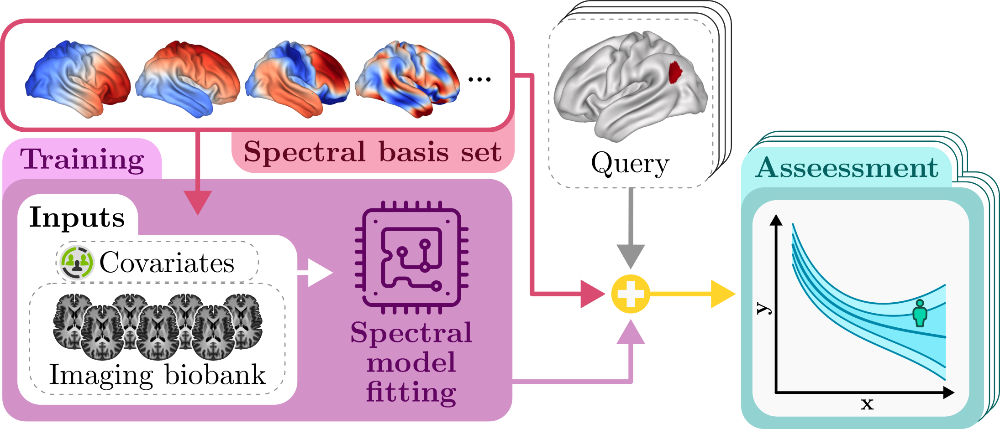
  
<a href="https://doi.org/10.1101/2025.01.16.25320639">Mansour L. et al. (2025)</a>

<myFooter />

---
layout: default
transition: slow-fade
---

# Spectral Normative Modeling (SNM)

🎖️ Performance

<ul class="text-5" v-motion:initial="{ x: -20 }":enter="{ x: -20 }">
  <li class="flex gap-2 pb-2">
    
<carbon:send />

    
With at least 1000 modes SNM achieves accurate estimates for normative ranges.

  </li>
</ul>

  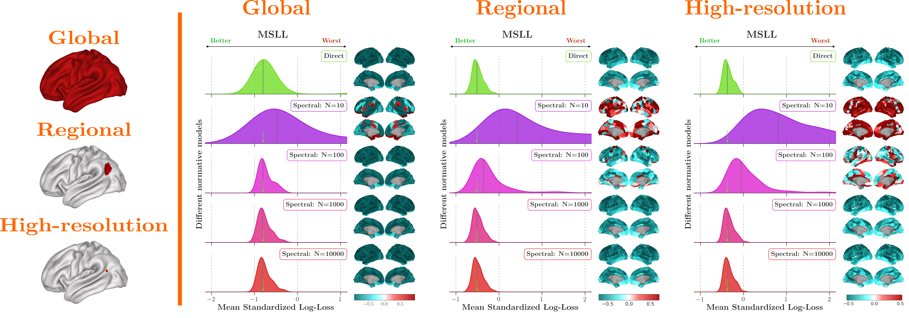
  
<a href="https://doi.org/10.1101/2025.01.16.25320639">Mansour L. et al. (2025)</a>

<myFooter />

---
layout: default
transition: slow-fade
---

# Utility of SNM

🔎 High-resolution normative modeling

<ul class="text-5" v-motion:initial="{ x: -20 }":enter="{ x: -20 }">
  <li class="flex gap-2 pb-2">
    
<carbon:send />

    
Utilize a large-scale sample of >70K brain scans.

  </li>
</ul>

  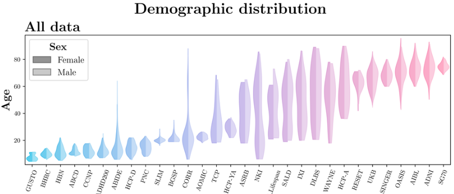
  
<a href="https://doi.org/10.1101/2025.01.16.25320639">Mansour L. et al. (2025)</a>

<myFooter />

---
layout: default
transition: slow-fade
---

# Utility of SNM

🔎 High-resolution normative modeling

<ul class="text-5" v-motion:initial="{ x: -20 }":enter="{ x: -20 }">
  <li class="flex gap-2 pb-2">
    
<carbon:send />

    
Efficiently estimate normative ranges at vertex-resolution across human lifespan.

  </li>
</ul>

  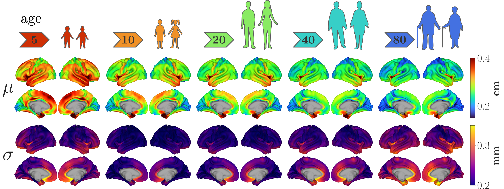
  
<a href="https://doi.org/10.1101/2025.01.16.25320639">Mansour L. et al. (2025)</a>

<myFooter />

---
layout: default
transition: slow-fade
---

# Utility of SNM

🔎 High-resolution normative modeling

<ul class="text-5" v-motion:initial="{ x: -20 }":enter="{ x: -20 }">
  <li class="flex gap-2 pb-2">
    
<carbon:send />

    
Enables mapping individualized vertex-resolution normative assessment.

  </li>
</ul>

  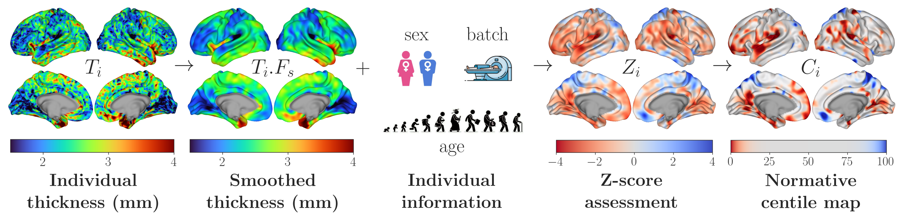
  
<a href="https://doi.org/10.1101/2025.01.16.25320639">Mansour L. et al. (2025)</a>

<myFooter />

---
layout: default
transition: slow-fade
---

# Clinical application in AD

👥 Population-level pathology assessment

<ul class="text-5" v-motion:initial="{ x: -20 }":enter="{ x: -20 }">
  <li class="flex gap-2 pb-2">
    
<carbon:send />

    
Transfer learning: Normative cortical correlates of cognitive impairment in AD

  </li>
</ul>

  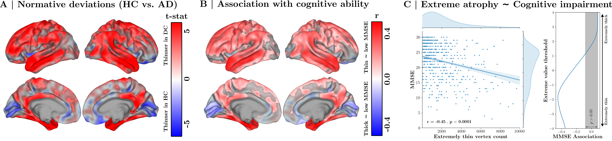
  
<a href="https://doi.org/10.1101/2025.01.16.25320639">Mansour L. et al. (2025)</a>

<myFooter />

---
layout: default
transition: slow-fade
---

# Clinical application in AD

👤 Individual-level assessments

<ul class="absolute text-5" v-motion :initial="{ x: -50}" :enter="{ x : 0}" :leave="{ x : 50}">
  <li class="flex gap-2 pb-2">
    
<carbon:send />

    
Probing inter-individual variability in atrophy:

  </li>
</ul>

  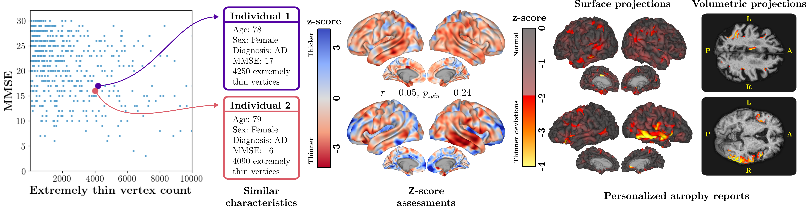
  
<a href="https://doi.org/10.1101/2025.01.16.25320639">Mansour L. et al. (2025)</a>

<myFooter />

---
layout: default
transition: slow-fade
---

# Modeling Other Phenotypes & Modalities

🤝 Ideas for future collaborations

<ul class="absolute text-5" v-click="1" v-motion :initial="{ x: -50}" :enter="{ x : 0}" :leave="{ x : 50}">
  <li class="flex gap-2 pb-2" v-click="1">
    
<carbon:send />

    
Do you have data to share?

  </li>
  <li class="flex gap-2 pb-2" v-click="2">
    
<carbon:send />

    
Access to in-house developing normative modeling software.

  </li>
  <li class="flex gap-2 pb-2" v-click="3">
    
<carbon:send />

    
Cross-norm associations.

  </li>
  <li class="flex gap-2 pb-2" v-click="4">
    
<carbon:send />

    
Individual-calibrated models from activity/sleep data.

  </li>
  <li class="flex gap-2 pb-2" v-click="5">
    
<carbon:send />

    
Let's turn these into a grant proposal...   or at least a good coffee conversation. ☕

  </li>
</ul>

  

  

  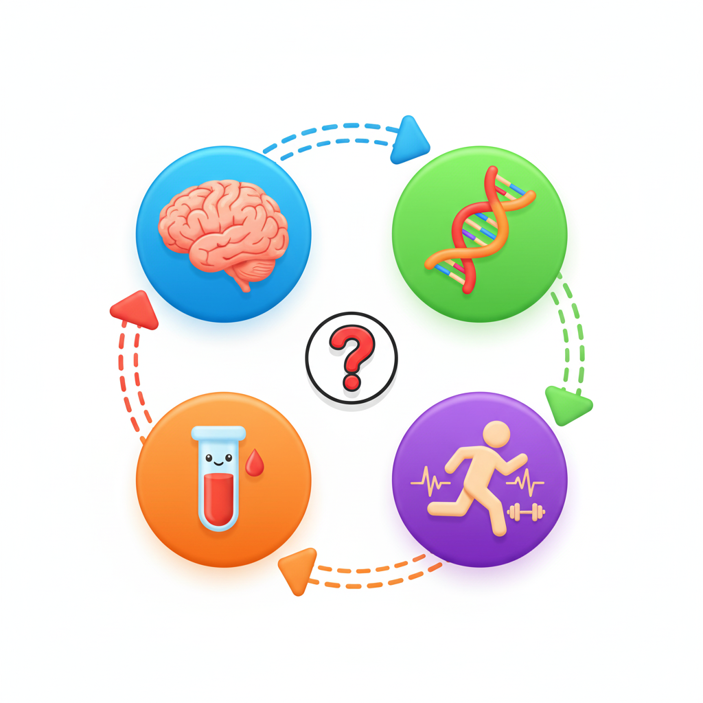

  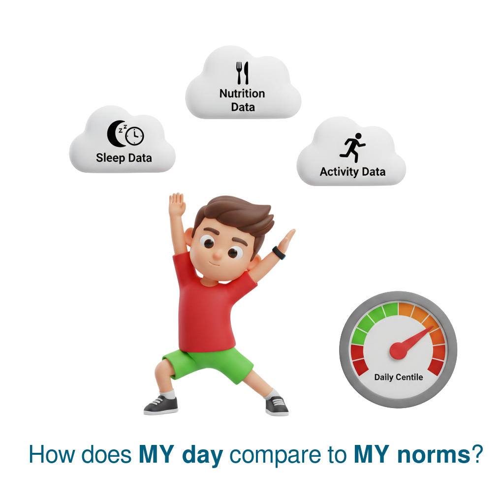

  

<myFooter />

---
layout: default
transition: fade-out
---

# Acknowledgements

  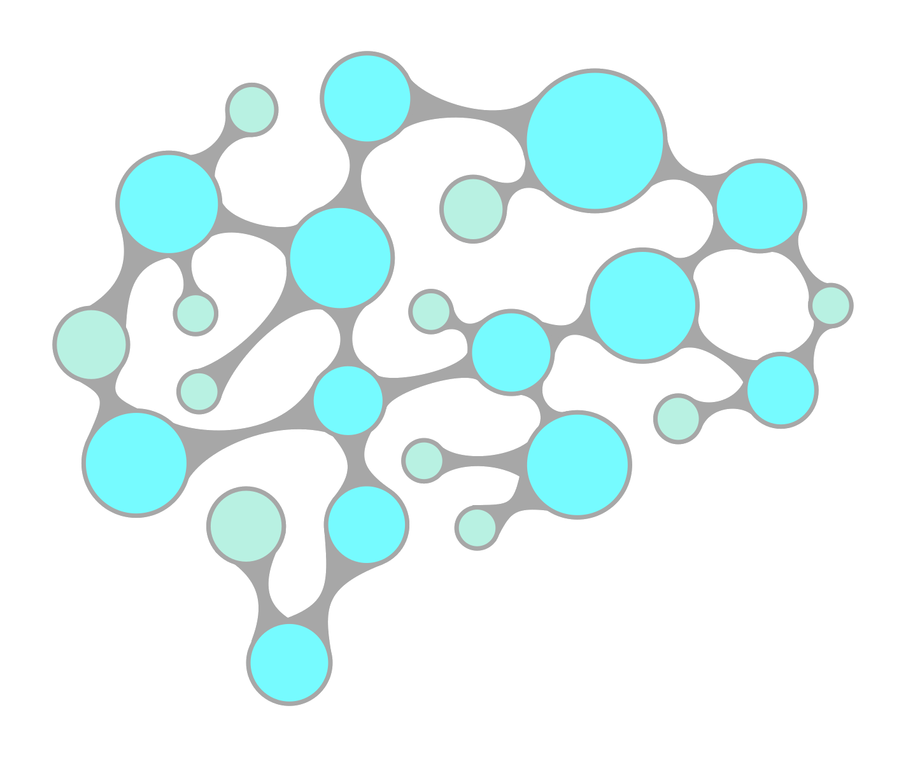

  
  
  
  
  
  
  
  
  
  
  
  
  
  
  
  
  
  

  B.T. Thomas Yeo,  
  Christopher Chen,  
  Aihuiping Xue,  
  Shaoshi Zhang,  
  Joanna Chong,  
  Zhang Yichi,  
  Eric Ng,  
  Teng Yinghui

  Juan Helen Zhou,  
  Hongwei Yan,  
  Chen Zhang,  
  Tian Fang,  
  Niousha Dehestani,  
  Ji Fang,  
  Xing Qian,  

  N. Venketasubramanian,  
  Eddie Chong  

  Andrew Zalesky,  
  Maria Di Biase,  
  Vanessa Cropley

  Robert E. Smith

  Aaron Alexander-Bloch,  
  Jakob Seidlitz

  Dimitri Van De Ville,  
  Hamid Behjat

  Richard Bethlehem

  Thank You!  

<myFooter />

---
layout: default
transition: slow-fade
---

# Clinical application in AD

👤 Individual-level assessments

<ul class="absolute text-5" v-click="[1,2]" v-motion :initial="{ x: -50}" :enter="{ x : 0}" :leave="{ x : 50}">
  <li class="flex gap-2 pb-2" v-click="[1,2]">
    
<carbon:send />

    
Probing inter-individual variability in atrophy:

  </li>
</ul>

  
  
<a href="https://doi.org/10.1101/2025.01.16.25320639">Mansour L. et al. (2025)</a>

<ul class="absolute text-5" v-click="[2,3]" v-motion :initial="{ x: -50}" :enter="{ x : 0}" :leave="{ x : 50}">
  <li class="flex gap-2 pb-2" v-click="2">
    
<carbon:send />

    
Hypothetical patterns of inter-individual variability:

  </li>
</ul>

  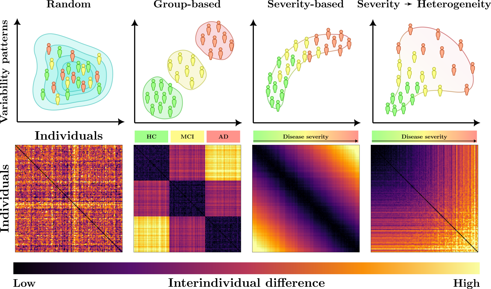
  
<a href="https://doi.org/10.1101/2025.01.16.25320639">Mansour L. et al. (2025)</a>

  

<ul class="absolute text-5" v-click="[3,4]" v-motion :initial="{ x: -50}" :enter="{ x : 0}" :leave="{ x : 50}">
  <li class="flex gap-2 pb-2" v-click="3">
    
<carbon:send />

    
Empirical variability in clinical data:

  </li>
</ul>

  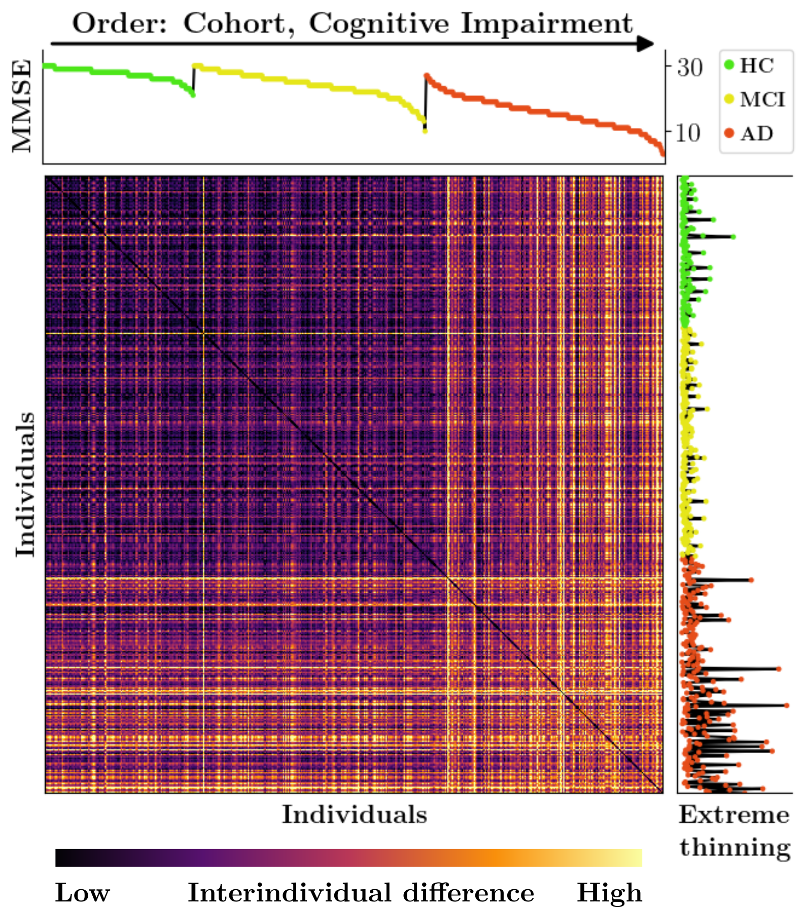
  

<ul class="absolute text-5" v-click="[4,8]" v-motion :initial="{ x: -50}" :enter="{ x : 0}" :leave="{ x : 50}">
  <li class="flex gap-2 pb-2" v-click="4">
    
<carbon:send />

    
Individual heterogeneity  landscape in AD:

  </li>
</ul>

  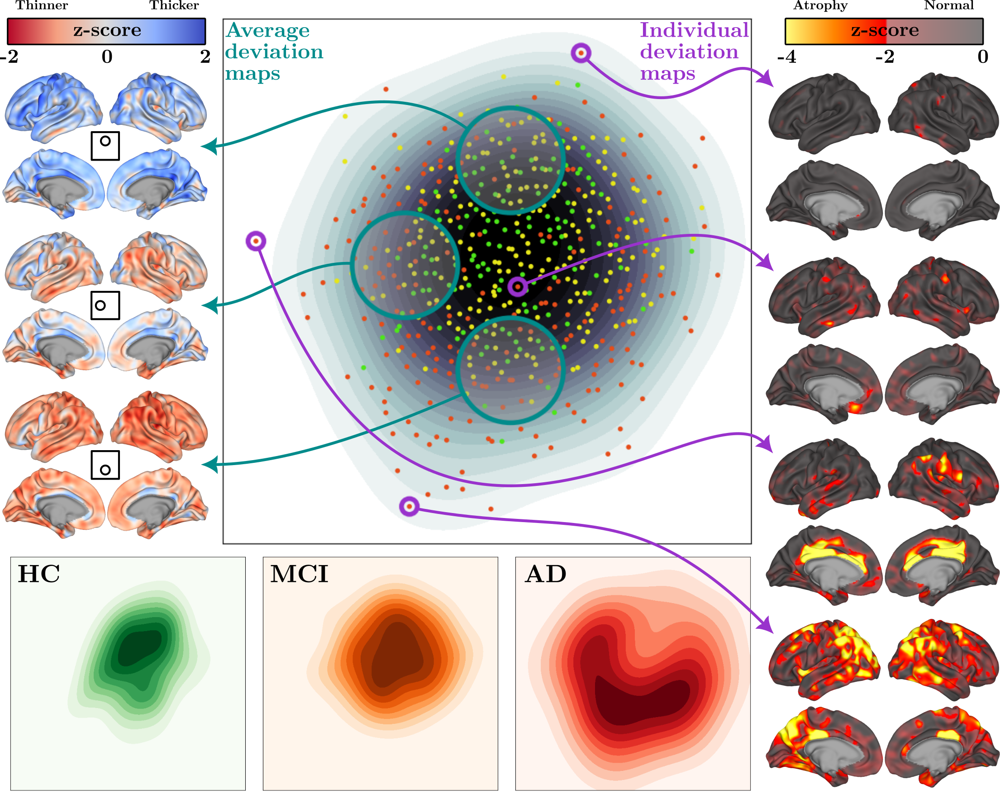
  

  

  

  

  

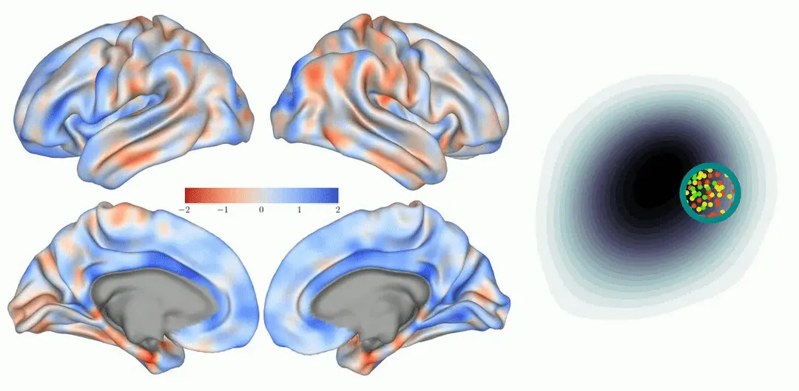

<myFooter />

